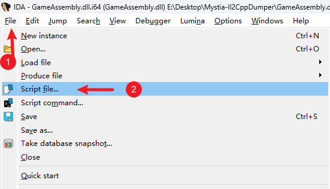

# 开发入门

欢迎加入MetaMystia的开发！本指南将引导你完成开发环境的搭建、工具安装以及基础的逆向分析流程。

## 编译项目

0. 安装[.Net 10 SDK](https://dotnet.microsoft.com/zh-cn/download/dotnet/10.0)
1. 拥有一份《[东方夜雀食堂](https://store.steampowered.com/app/1584090)》的**合法**拷贝
2. 克隆[MetaMystia](https://github.com/MetaMikuAI/MetaMystia)仓库
3. 下载最新的[BepInEx-Unity.IL2CPP-win-x64](https://builds.bepinex.dev/projects/bepinex_be)并将其解压到游戏根目录
4. 将游戏的安装路径复制并填入[MetaMystia.csproj](https://github.com/MetaMikuAI/MetaMystia/blob/main/MetaMystia.csproj)的`<GamePath>` 标签中
5. 启动游戏一次，在进入主菜单后关闭游戏，以生成必要的文件
6. 在支持.Net Sln 的IDE中打开仓库根目录下的`MetaMystia.sln`
7. 编译项目

## 安装工具

为了进行高效的Mod开发和逆向分析，建议安装以下工具：

### 核心工具

#### IDA Pro

用于分析反汇编代码及动态调试。

- [官方网站](https://hex-rays.com/ida-pro)

    _注：Free版本亦可使用，但推荐使用Pro版以获得更完整的功能。本文档不提供任何破解方法。_

#### dnSpy

用于静态分析.NET程序集，快速定位类、字段及方法的虚拟地址。

- [GitHub仓库](https://github.com/dnSpy/dnSpy)

#### Il2CppDumper

用于自动分析并还原Il2Cpp游戏的符号信息。

- [GitHub仓库](https://github.com/Perfare/Il2CppDumper)

### 推荐插件 (可选)

#### IDA-Pro-MCP

允许AI Agent访问IDA工具，辅助快速定位与分析。

- 安装参考：[Installation](https://github.com/mrexodia/ida-pro-mcp?tab=readme-ov-file#installation)

#### dnSpy.Cpp2IL

dnSpy插件。

- 安装参考：[How to install](https://github.com/BadRyuner/dnspy.Cpp2IL?tab=readme-ov-file#how-to-install)

## 逆向分析准备

本节介绍如何使用上述工具对游戏进行初步分析。

### 使用Il2CppDumper还原符号

1. 运行`Il2CppDumper.exe`
2. 根据提示先后加载：
    - 游戏目录下的`GameAssembly.dll`
    - 游戏目录下的`Touhou Mystia Izakaya_Data/il2cpp_data/Metadata/global-metadata.dat`
3. 等待工具自动分析完成

### 导入dnSpy

1. 将Il2CppDumper生成的`DummyDll/Assembly-CSharp.dll`导入dnSpy
1. 通过此文件可以方便地查看游戏逻辑的类结构、字段名称以及方法的虚拟地址

### 导入IDA Pro

1. **备份**游戏的`GameAssembly.dll`
2. 使用IDA Pro打开`GameAssembly.dll`，等待其完成自动分析（初次加载可能较慢）
3. 点击`File -> Script file`，运行Il2CppDumper提供的`ida_with_struct_py3.py`脚本
4. 根据脚本提示，分别选择生成的`script.json`和`il2cpp.h`，等待解析完成

    

5. **保存数据库**：关闭IDA时，建议勾选`Collect`后保存

    

6. **备份数据库**：建议备份生成的`GameAssembly.dll.i64`，以便在分析出错时快速恢复
