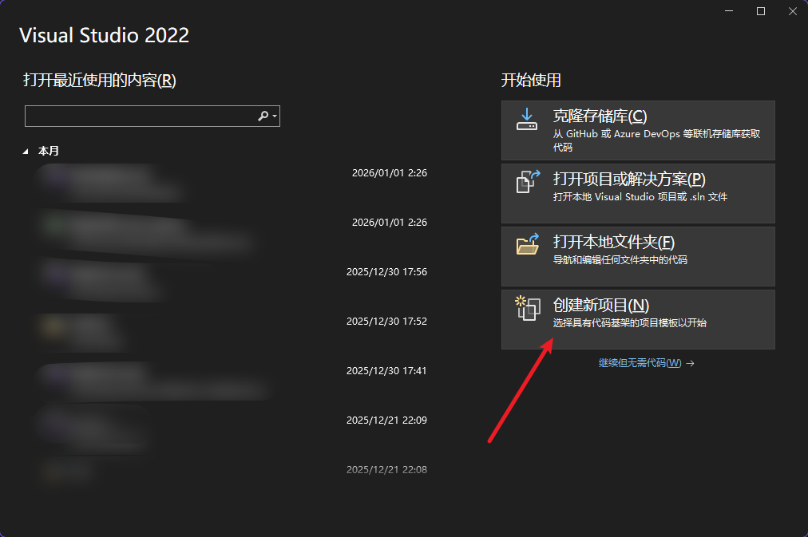
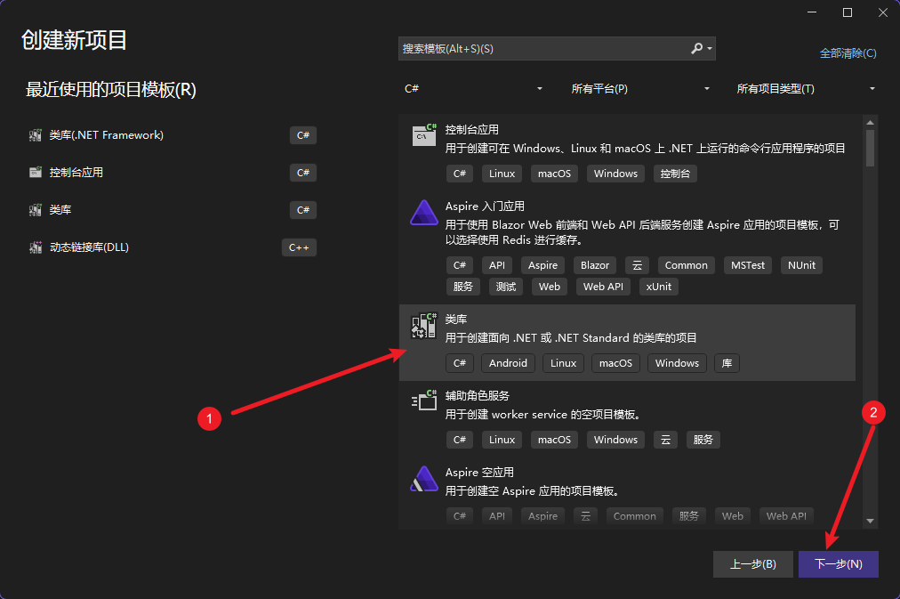
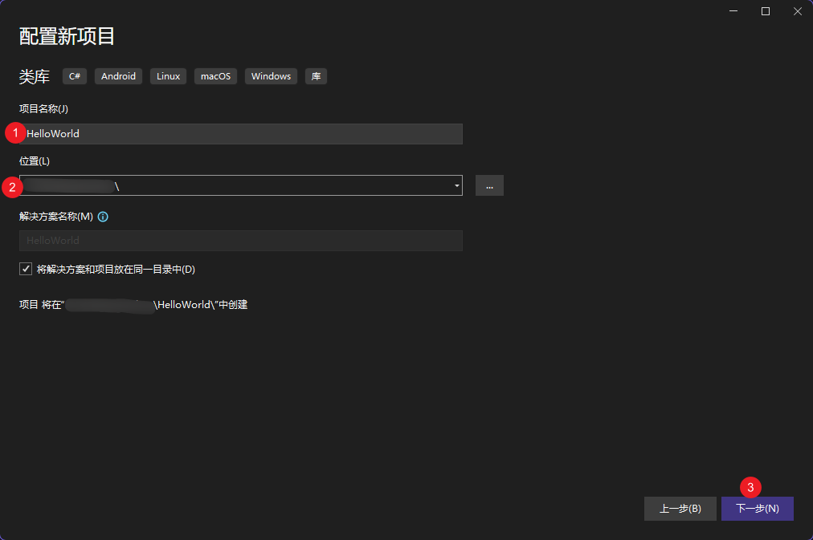
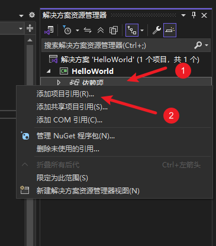
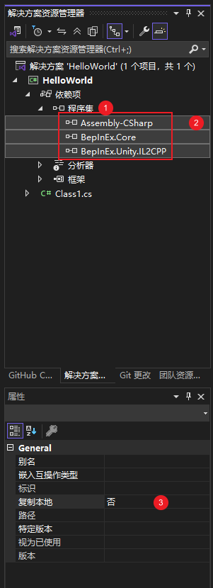
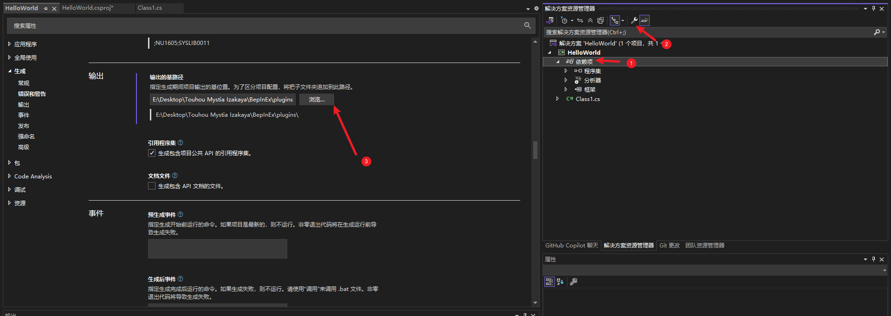
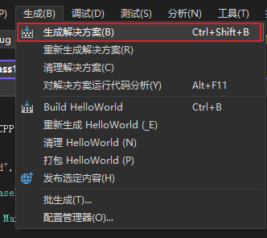
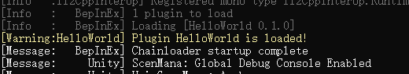
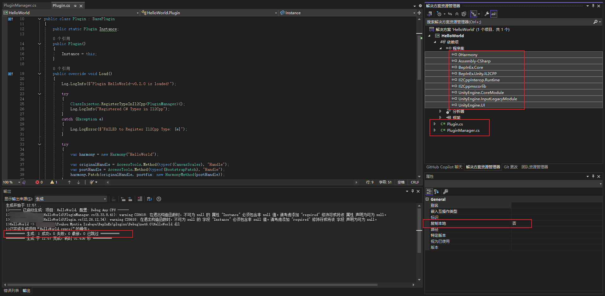
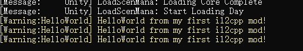

# Hello World 其一

从零基础阅读MetaMystia项目代码并尝试贡献是有一定难度的，中文互联网对于Unity il2cpp游戏的BepInEx Mod开发相关资料也较为匮乏。从本节开始，我们将由浅入深，结合实战，带您体验开发Unity il2cpp游戏的Mod。

## 什么是il2cpp

Unity游戏大致可以分为两类：使用Mono运行时的传统Unity游戏，以及使用il2cpp技术构建的Unity游戏。

在Mono模式下，Unity会将C#脚本编译为IL（中间语言），运行时由Mono虚拟机解释或JIT执行。这意味着游戏目录中通常会存在`Assembly-CSharp.dll`、`mscorlib.dll`等标准.NET程序集，开发者和Mod作者都可以直接反编译这些DLL来获取完整的C#源码结构。

而il2cpp则采用了完全不同的路线。
在构建阶段，Unity会先将所有C#脚本转换为C++代码，再由平台原生编译器（如MSVC、Clang）编译为最终的机器码。在Windows平台上，这些代码最终会被打包进一个名为`GameAssembly.dll`的本地动态库中。此时，运行时已经不再存在.NET IL与Mono虚拟机，而是一个完全本地化的程序。

这一步带来的直接后果是：
**我们在逆向时不再面对C#或IL，而是面对高度优化过的C++机器码。**
在Mono游戏中，类、方法、字段和函数签名都可以通过反射或反编译直接获取；而在il2cpp游戏中，这些信息已经被“编译掉”，只剩下函数地址、结构体布局和调用关系，需要通过额外的元数据和工具才能重新还原。

## 判断Mono/il2cpp

判断一个Unity游戏使用哪种运行时非常简单，通常只需要查看游戏目录即可：

- 如果游戏目录中存在：

    ```
    GameAssembly.dll
    global-metadata.dat
    ```

    那么它使用的是**il2cpp**

- 如果游戏目录中存在：

    ```
    Assembly-CSharp.dll
    UnityEngine.dll
    mscorlib.dll
    ```

    且没有`GameAssembly.dll`，那么它使用的是**Mono**

在Windows平台上，il2cpp游戏通常还会有：

```
<游戏名>_Data\il2cpp_data\
```

目录，用于存放`global-metadata.dat`以及其他运行时数据。

## global-metadata与逆向难度的来源

虽然il2cpp把C#编译成了本地代码，但Unity仍然需要在运行时保留一份类型系统和反射信息，因此这些数据被集中存放在一个名为`global-metadata.dat`的文件中。这个文件包含了类名、方法名、字段、参数类型、继承关系等关键信息，它相当于il2cpp世界里的“灵魂”。

但与Mono不同的是，这份元数据与`GameAssembly.dll`中的函数和结构体并没有直接的符号关联。Unity在编译时会打乱、内联、重排大量函数，使得“哪个C++函数对应哪个C#方法”在二进制层面是不可见的。像Il2CppDumper这样的工具，正是通过解析`global-metadata.dat`并结合`GameAssembly.dll`的内部表结构，反推出这些映射关系，才能让我们在IDA中重新看到熟悉的类名和方法名。

## 创建项目

> [!CAUTION]
>
> 如果阅读下面出现的代码让您感到吃力，可以先阅读本章最后一节[小结](#小结)，了解哪些是值得关注的重点内容，而哪些可以暂时跳过。

确保已经按照[开发入门](../getting_started.md)完成了BepInEx的安装，并至少完整启动过一次游戏。

以Visual Studio为例，创建一个新的“类库“项目，命名为`HelloWorld`







使用.NET 6.0


## 添加引用

右键**解决方案**中的**依赖项**，选择**添加项目引用**



首先为项目添加游戏根目录下

```
./BepInEx/interop/Assembly-CSharp.dll
./BepInEx/core/BepInEx.Core.dll
./BepInEx/core/BepInEx.Unity.IL2CPP.dll
```

并为所添加的三个`.dll`设定**不要复制本地**



修改输出路径到`BepInEx`的`plugins`文件夹下



在`Class1.cs`中编写代码

```csharp
using BepInEx;
using BepInEx.Logging;
using BepInEx.Unity.IL2CPP;
namespace HelloWorld;

[BepInPlugin("HelloWorld", "HelloWorld", "0.1")]
public class Plugin : BasePlugin
{
    internal static new ManualLogSource Log;

    public override void Load()
    {
        Log = base.Log;
        Log.LogWarning($"Plugin HelloWorld is loaded!");
    }
}
```

点击**生成**中的**生成解决方案**来构建Mod dll



确定解决方案生成成功，启动游戏，即可看到控制台的输出



添加新的引用并设定禁止复制本地

```
./BepInEx/core/0Harmony.dll
./BepInEx/core/Il2CppInterop.Runtime.dll
./BepInEx/interop/Il2Cppmscorlib.dll
./BepInEx/interop/UnityEngine.CoreModule.dll
./BepInEx/interop/UnityEngine.InputLegacyModule.dll
./BepInEx/interop/UnityEngine.UI.dll
```

重命名`Class1.cs`至`Plugin.cs`，编写代码

```csharp
using BepInEx;
using BepInEx.Unity.IL2CPP;
using HarmonyLib;
using Il2CppInterop.Runtime.Injection;
using UnityEngine.UI;

namespace HelloWorld;

[BepInPlugin("HelloWorld", "HelloWorld", "0.0.0")]
public class Plugin : BasePlugin
{
    public static Plugin Instance;

    public Plugin()
    {
        Instance = this;
    }

    public override void Load()
    {
        Log.LogInfo($"Plugin HelloWorld-v0.0.0 is loaded!"); // Mod 加载时会打印该信息

        try
        {
            ClassInjector.RegisterTypeInIl2Cpp<PluginManager>();
            Log.LogInfo("Registered C# Types in Il2Cpp");
        }
        catch (Exception e)
        {
            Log.LogError($"FAILED to Register Il2Cpp Type: {e}");
        }

        try
        {
            var harmony = new Harmony("HelloWorld");

            var originalHandle = AccessTools.Method(typeof(CanvasScaler), "Handle");
            var postHandle = AccessTools.Method(typeof(BootstrapPatch), "Handle");
            harmony.Patch(originalHandle, postfix: new HarmonyMethod(postHandle));
        }
        catch
        {
            Log.LogError("FAILED to Apply Hooks!");
        }
    }

    class BootstrapPatch
    {
        [HarmonyPostfix]
        static void Handle()
        {
            if (PluginManager.Instance == null)
            {
                Plugin.Instance.Log.LogMessage("Bootstrapping Trainer...");
                try
                {
                    PluginManager.Create("PluginManager");
                    if (PluginManager.Instance != null)
                    {
                        Plugin.Instance.Log.LogMessage("Trainer Bootstrapped!");
                    }
                }
                catch (Exception e)
                {
                    Plugin.Instance.Log.LogMessage($"ERROR Bootstrapping Trainer: {e.Message}");
                }
            }
        }
    }
}
```

新建`PluginManager.cs`，编写代码

```csharp
using BepInEx.Logging;
using Il2CppInterop.Runtime;
using UnityEngine;

namespace HelloWorld;
public class PluginManager : MonoBehaviour
{
    public static PluginManager Instance { get; private set; }
    public static ManualLogSource Log => Plugin.Instance.Log;

    public PluginManager(IntPtr ptr) : base(ptr)
    {
        Instance = this;
    }

    internal static GameObject Create(string name)
    {
        var gameObject = new GameObject(name);
        DontDestroyOnLoad(gameObject);

        var component = new PluginManager(gameObject.AddComponent(Il2CppType.Of<PluginManager>()).Pointer);

        return gameObject;
    }

    private void Awake()
    {

    }

    private void Update() // Unity 每一帧都会调用该方法
    {
        if (Input.GetKeyDown(KeyCode.F1)) // 按下 F1 键时
        {
            Log.Warning("HelloWorld from my first il2cpp Mod!"); // 在控制台打印一行日志
        }
    }
}
```



确定解决方案生成成功，启动游戏，按下<kbd>F1</kbd>，即可看到控制台的输出



到这里为止，我们已经成功完成了一个最基础的il2cpp Mod：

它可以被BepInEx加载、可以在Unity生命周期中运行，并且能够通过按键触发自己的逻辑。这一步的意义，并不在于“打印了一行 HelloWorld“，而在于我们已经建立起了一个可以在il2cpp游戏中稳定执行自定义C#代码的注入点。

然而，这个Mod目前仍然是“自说自话”的：
它没有读取游戏状态，也没有修改任何游戏行为。要让它真正成为一个“游戏Mod”，我们还需要知道——游戏的逻辑在哪里，函数在哪里，数据在哪里。

## 小结

本节重点更在于认识il2cpp，学会创建一个最基础的il2cpp Mod，包括

1. 创建类库项目
2. 添加必要引用
3. 粘贴模板代码
4. 构建并运行Mod

对于逆向和Mod开发的初学者来说，直接理解全部代码是没有意义的，想象一个C语言初学者，在第一次接触到下面的代码

```c
#include <stdio.h>
int main(int argc, char** argv) {
	printf("Hello, World!\n");
	return 0;
}
```

他并不需要理解`#include`、`int main`、`argc/argv`等所有细节，只需要知道：

> 我在这个“模板代码“中的“恰当位置“写`printf`就能让我的程序说任意我想说的话。

我们更推荐初学者多实践、多尝试，先把“能跑起来“这件事做好，再逐步深入理解每一行代码的细节含义。在感到基础知识不足时，结合问题去查阅相关资料，而后应用到新的尝试中去。
