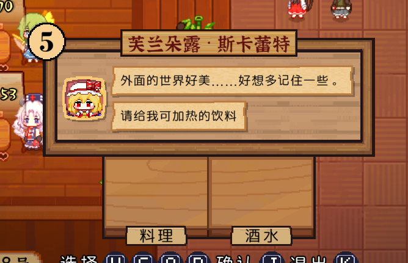

# ResourceEx Module

[**ResourceEx**](https://github.com/MetaMikuAI/MetaMystia/tree/main/ResourceEx)是MetaMystia提供的资源扩展模块，旨在帮助创作者为《东方夜雀食堂》添加**自定义资源内容**。

目前，ResourceEx已支持配置：

- 稀客基本信息
- 图鉴描述
- 立绘贴图
- 携带金钱
- 评价语句
- 闲聊语句
- 食物与酒水的喜好与厌恶标签
- 食物与酒水的点单需求
- 出没地点
- 角色小人贴图
- 自定义角色对话包内容

配合对应的在线工具，即使不具备复杂开发环境，也可以较为轻松地制作扩展资源。

## 配套工具

为了降低资源制作门槛，项目提供了**MetaMystia-ResourceEx-Editor**——一个面向创作者的**在线资源描述文件编辑器**，用于创建和编辑扩展资源描述文件（`ResourceEx.json`）。

该工具具备以下特点：

- 可视化编辑资源描述，无需手写JSON
- 无需本地开发环境，浏览器即可使用
- 适合希望尝试自定义内容或参与制作的玩家与创作者

相关链接：

- GitHub：[https://github.com/MetaMikuAI/MetaMystia-ResourceEx-Editor](https://github.com/MetaMikuAI/MetaMystia-ResourceEx-Editor)
- 在线体验：[https://editor.meta-mystia.izakaya.cc](https://editor.meta-mystia.izakaya.cc)

## 演示





> （演示视频将在后续补充）

## 使用方法

### 目录结构

在游戏根目录下创建`ResourceEx`目录，并为每个资源包建立独立文件夹。推荐的目录结构如下：

```tree
./ResourceEx/
├── YourResName/
│   ├── assets/
│   │   ├── YourCharacter_0.png
│   │   ├── YourCharacter_1.png
│   │   ├── AnotherCharacter_0.png
│   │   ├── AnotherCharacter_1.png
│   │   └── ...
│   └── ResourceEx.json
├── YourResName2/
│   ├── assets/
│   │   ├── OneMoreCharacter_0.png
│   │   ├── OneMoreCharacter_1.png
│   │   └── ...
│   └── ResourceEx.json
└── ...
```

示例：

```tree
./ResourceEx/
└── MetaMystia/
    ├── assets/
    │   ├── AkiMinoriko_0.png
    │   ├── AkiSizuha_0.png
    │   └── YakumoRan_0.png
    └── ResourceEx.json
```

### ResourceEx.json配置文件

`ResourceEx.json`是资源包的核心描述文件，用于声明角色信息与对话包内容。

可以参考项目仓库中的[示例文件](https://github.com/MetaMikuAI/MetaMystia/blob/main/ResourceEx/MetaMystia/ResourceEx.json)：

```
./ResourceEx/MetaMystia/ResourceEx.json
```

当前支持两个顶级字段：

- `characters`：角色定义
- `dialogPackages`：对话包定义

示例配置如下：

```json
{
	"characters": [
		{
			"id": 10000,
			"name": "秋静叶",
			"label": "AkiSizuha",
			"descriptions": ["红叶之神", "八百万之神", "掌管红叶程度的能力"],
			"type": "Special",
			"portraits": [{ "pid": 0, "path": "assets/AkiSizuha_0.png" }]
		},
		{
			"id": 10001,
			"name": "秋穰子",
			"label": "AkiMinoriko",
			"descriptions": ["丰收之神", "八百万之神", "掌管丰收程度的能力"],
			"type": "Special",
			"portraits": [{ "pid": 0, "path": "assets/AkiMinoriko_0.png" }]
		},
		{
			"id": 10002,
			"name": "八云蓝",
			"label": "YakumoRan",
			"descriptions": ["使役式神程度的能力", "", ""],
			"type": "Special",
			"portraits": [{ "pid": 0, "path": "assets/YakumoRan_0.png" }]
		}
	],
	"dialogPackages": [
		{
			"name": "Test",
			"dialogList": [
				{
					"characterId": 10000,
					"characterType": "Special",
					"pid": 0,
					"position": "Left",
					"text": "马上就要到秋天了呢。树叶啊，总让人觉得到了秋天才会变成红色，但其实从发芽的时候，它们就开始带上了美丽而虚幻的鲜红哦。只不过，叶子们在整个夏天都会把它隐藏起来……像这样害羞的落叶正在努力舞蹈着。"
				},
				{
					"characterId": 10001,
					"characterType": "Special",
					"pid": 0,
					"position": "Right",
					"text": "秋穰子Testing..."
				},
				{
					"characterId": 10002,
					"characterType": "Special",
					"pid": 0,
					"position": "Left",
					"text": "八云蓝Testing..."
				}
			]
		}
	]
}
```

> [!TIP]
> 推荐使用MetaMystia-ResourceEx-Editor自动生成`ResourceEx.json`文件。

## 注意事项

1. 角色ID分配规则：
    - 0–999：游戏原有资源
    - 1000–5999：DLC资源
    - 6000-8999: 为原游戏预留的扩展段
    - 9000–10999：MetaMystia保留扩展段
    - 11000及以上：创作者自定义资源

> [!CAUTION]
> 请避免使用0–10999范围内的ID。建议以每1000为一个独立创作区间，减少冲突。

## 对话展示与触发

当前ResourceEx仅负责**加载并注入对话数据**，尚未提供完整的对话触发逻辑。

对于自行编写逻辑或调试的开发者，暂时可通过`WebDebugger`的简易`Console`手动触发指定对话包：

```csharp
MetaMystia.Dialog.ShowResourceExPackage("YourDialogPackageName", null)
```

## 关于版权

本项目及其开发者**不拥有**`/ResourceEx/MetaMystia/`目录下所包含资源的版权。

相关资源版权归以下原作者及团队所有：

- 《东方夜雀食堂》：[https://store.steampowered.com/app/1584090/](https://store.steampowered.com/app/1584090/)
- 《东方秋神牧场》：[https://www.bilibili.com/video/av115196056114538](https://www.bilibili.com/video/av115196056114538)
- 创作团队**二色幽紫蝶**：[https://space.bilibili.com/86865890](https://space.bilibili.com/86865890)

部分文案引用自：

- 东方夜雀食堂动画版EX短篇预览：[https://www.bilibili.com/video/BV1FfH7zpEw1](https://www.bilibili.com/video/BV1FfH7zpEw1)

如您希望成为新的资源包创作者，请确保：

- 您对所使用的素材拥有合法版权，或已获得原作者的二次创作授权
- 不侵害**二色幽紫蝶**及任何第三方创作者的合法权益
- 严格遵循《[东方Project使用规定](https://www.bilibili.com/opus/400555526272745308)》
