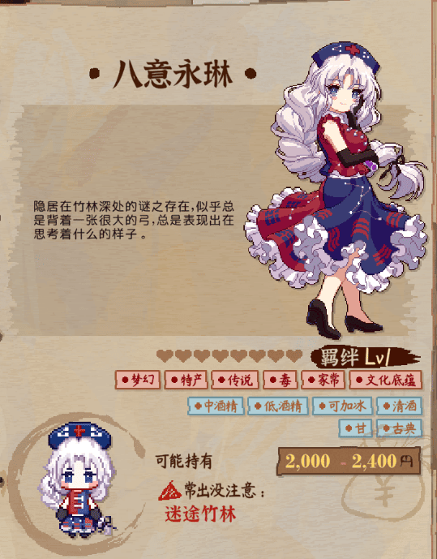
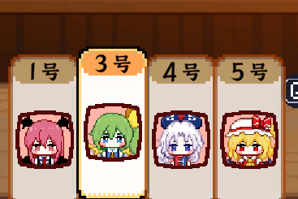
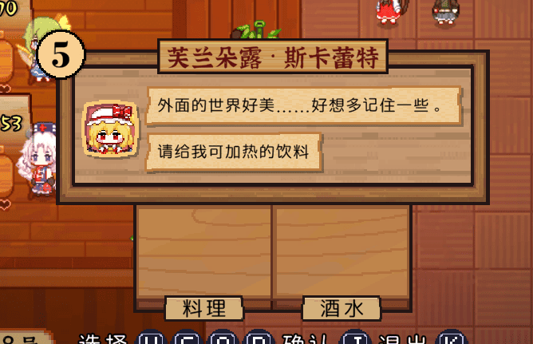
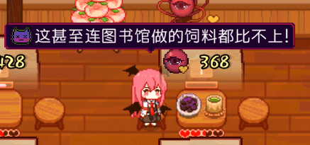

# ResourceEx Module

[**ResourceEx**](https://github.com/MetaMikuAI/MetaMystia/tree/main/ResourceEx)是MetaMystia提供的资源扩展模块，旨在帮助创作者为《东方夜雀食堂》添加**自定义资源内容**。

目前，ResourceEx已支持配置：

- 稀客基本信息
- 图鉴描述
- 立绘贴图
- 携带金钱
- 评价语句
- 闲聊语句
- 食物与酒水的喜好与厌恶标签
- 食物与酒水的点单需求
- 出没地点
- 角色小人贴图
- 自定义角色对话包内容
- 自定义原料、食谱与食物
- 自定义剧情
- 自定义羁绊事件和任务
- 白天出生地点

配合对应的在线工具，即使不具备复杂开发环境，也可以较为轻松地制作扩展资源。

## 配套工具

为了降低资源制作门槛，项目提供了**MetaMystia-ResourceEx-Editor**——一个面向创作者的**在线资源描述文件编辑器**，用于创建和编辑扩展资源描述文件（`ResourceEx.json`）。

该工具具备以下特点：

- 可视化编辑资源描述，无需手写JSON
- 无需本地开发环境，浏览器即可使用
- 适合希望尝试自定义内容或参与制作的玩家与创作者

相关链接：

- GitHub：[https://github.com/MetaMikuAI/MetaMystia-ResourceEx-Editor](https://github.com/MetaMikuAI/MetaMystia-ResourceEx-Editor)
- 在线体验：[https://editor.meta-mystia.izakaya.cc](https://editor.meta-mystia.izakaya.cc)

## 演示










> （演示视频将在后续补充）

## 使用方法

### 资源包构建

您无需手动管理目录结构、图片资源及`ResourceEx.json`文件，推荐直接使用[MetaMystia-ResourceEx-Editor](https://editor.meta-mystia.izakaya.cc)在线工具生成。

## 注意事项

1. 角色ID分配规则：
    - 0–999：游戏原有资源
    - 1000–5999：DLC资源
    - 6000-8999: 为原游戏预留的扩展段
    - 9000–11999：MetaMystia保留扩展段
    - 12000及以上：创作者自定义资源

> [!CAUTION]
> 请避免使用0–11999范围内的ID。建议以每1000为一个独立创作区间，减少冲突。
>
> 也可以向MetaMystia开发团队申请专属ID段，以确保资源包的唯一性。

## 对话展示与触发

当前ResourceEx仅负责**加载并注入对话数据**，尚未提供完整的对话触发逻辑。

对于自行编写逻辑或调试的开发者，暂时可通过`WebDebugger`的简易`Console`手动触发指定对话包：

```csharp
MetaMystia.Dialog.ShowResourceExPackage("YourDialogPackageName", null)
```

## 关于版权

MetaMystia 给出的资源包包含来自不同来源的内容，不同部分适用不同版权规则。请在使用或再分发前仔细阅读。

### 一、原作版权声明

本 Mod 为基于以下作品的非官方同人二次创作：

- 《东方Project》上海爱丽丝幻乐团@ZUN
- 《东方夜雀食堂》二色幽紫蝶
- 《东方秋神牧场》二色幽紫蝶

与上述作品相关的角色、名称、世界观设定等原始版权归原作者或原版权方所有。

MetaMystia 项目不对原作内容主张版权。

### 二、不属于本项目授权范围的游戏原始资源

以下路径中的资源文件 并非 MetaMystia 项目原创内容，其美术资源版权归原游戏版权方所有。

来自 《东方夜雀食堂》二色幽紫蝶 的资源：

```
assets/Character/9000/*
assets/Character/9001/*
assets/Character/9002/*
assets/Character/9003/*
assets/Character/9004/*
```

来自 《东方秋神牧场》二色幽紫蝶 的资源：

```
assets/Character/10000/Portrait/0.png
assets/Character/10001/Portrait/0.png
assets/Character/10002/Portrait/0.png
```

这些文件仅在原作者相关作品授权范围内使用，

不属于 MetaMystia 项目的原创资源，也不适用于下文的 CC 许可。

MetaMystia 项目不对这些资源授予任何再分发或二次创作授权。

### 三、MetaMystia 项目原创资源许可

除第二节列出的内容，其余由 MetaMystia 项目组原创 的资源均采用：

> **Creative Commons Attribution–NonCommercial–ShareAlike 4.0 International
> (CC BY-NC-SA 4.0)**

你可以在遵守该协议的前提下进行非商业使用、修改与再创作，并需署名且以相同许可共享。

### 四、资源列表变更说明

MetaMystia 项目会随着开发进展持续更新资源内容。上述“非原创资源列表”可能在未来版本中发生变动（增加或移
除）。

请始终以 本文件在对应版本发布时的内容 作为版权归属判断依据。若对某个文件的版权状态存在疑问，应视为不属于
默认 CC 授权范围，除非有明确的原创或许可标注。

### 五、免责声明

本项目为非官方同人创作，与原作版权方无直接关联。
如原版权方提出要求，项目可能对相关内容进行修改或移除。

如您希望成为新的资源包创作者，请确保：

- 遵循所在国家或地区的相关法律法规
- 您对所使用的素材拥有合法版权，或已获得原作者的二次创作授权
- 不侵害**二色幽紫蝶**及任何第三方创作者的合法权益
- 严格遵循《[东方Project使用规定](https://www.bilibili.com/opus/400555526272745308)》
