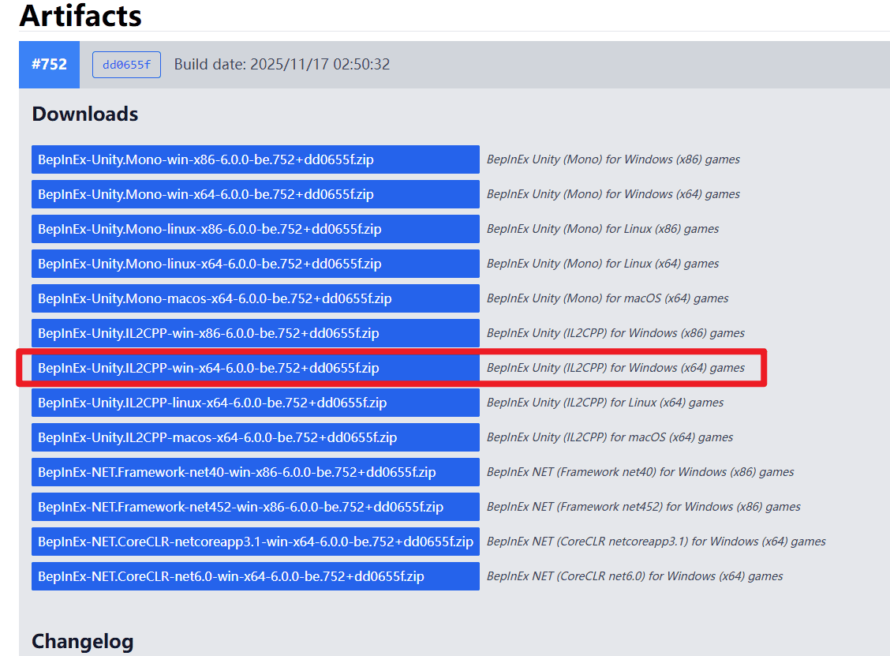
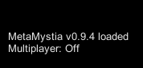

# 如何安装

本文将引导您完成**BepInEx**及**MetaMystia Mod**的安装流程。请按步骤操作。

## 一、下载安装BepInEx

1. 打开**BepInEx BE**的官方构建页面：
   [https://builds.bepinex.dev/projects/bepinex_be](https://builds.bepinex.dev/projects/bepinex_be)

2. 在页面中选择适用于《[东方夜雀食堂](https://store.steampowered.com/app/1584090/)》的**il2cpp**版本。
   注意：本游戏使用的是**il2cpp**，请选择对应版本，否则无法正常运行。

3. 对于绝大多数玩家，下载下图中标注的版本即可：

    

4. 下载完成后，将压缩包**解压到游戏的根目录**（也就是`Touhou Mystia Izakaya.exe`所在的文件夹）。

    解压完成后，目录结构应大致如下：

    ```
    Touhou Mystia Izakaya
    ├─BepInEx
    ├─dotnet
    ├─Touhou Mystia Izakaya_Data
    ├─东方夜雀食堂 头像&表情包 ~ Avatar Image
    ├─.doorstop_version
    ├─baselib.dll
    ├─changelog.txt
    ├─doorstop_config.ini
    ├─GameAssembly.dll
    ├─Touhou Mystia Izakaya.exe
    ├─UnityCrashHandler64.exe
    ├─UnityPlayer.dll
    └─winhttp.dll
    ```

5. 启动游戏。
   如果游戏启动时弹出一个**黑色控制台窗口**，说明BepInEx已成功安装。
   首次启动时加载时间可能稍长，请耐心等待。

## 二、下载安装Mod

1. 从以下任一地址下载最新版本的**MetaMystia.dll**（推荐通过GitHub）：
    - GitHub：
      [https://github.com/MetaMikuAI/MetaMystia/releases](https://github.com/MetaMikuAI/MetaMystia/releases)
    - 本站服务器：
      [https://url.izakaya.cc/getMetaMystia](https://url.izakaya.cc/getMetaMystia)

2. 下载完成后，将**MetaMystia.dll**文件放入以下目录：

    ```plaintext
    游戏根目录/BepInEx/plugins
    ```

    如果`plugins`文件夹不存在，您可以手动创建一个。

3. 再次启动游戏。
   当游戏左下角出现白色提示文字时，表示Mod已成功加载：

    

## 配置资源扩展ResourceEx（可选）

0. 备份游戏存档，以防止意外情况发生。
1. 在游戏根目录创建一个名为`ResourceEx`的文件夹
2. 从以下任意地址，下载资源包如`ResourceExample.zip`，**直接**放到`ResourceEx`文件夹**无需解压**
    - GitHub：
      [https://github.com/MetaMikuAI/MetaMystia/releases](https://github.com/MetaMikuAI/MetaMystia/releases)
    - 本站服务器：
      [https://url.izakaya.cc/getMetaMystia](https://url.izakaya.cc/getMetaMystia)
