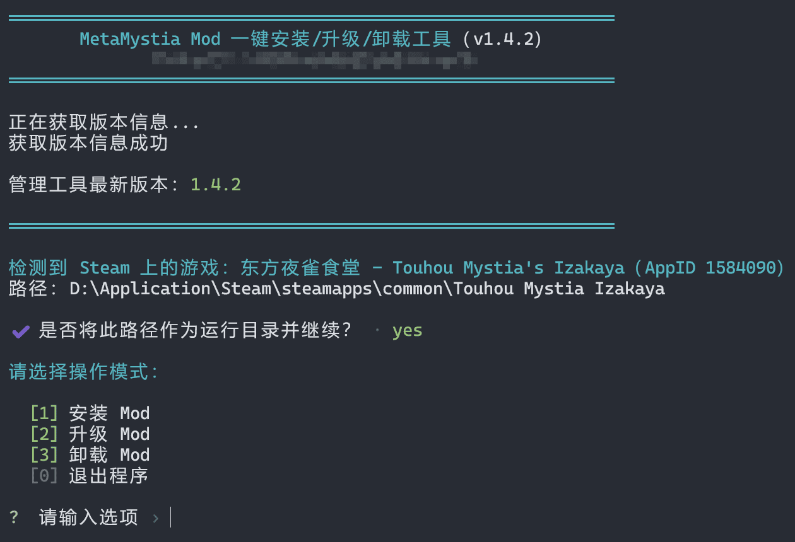

# 如何安装

本文将引导您完成**BepInEx**及**MetaMystia Mod**的安装流程。

## 一键安装 {#onclick_install}

我们提供了一键安装、升级、卸载MetaMystia Mod的工具，推荐您使用这个工具来方便地进行相关管理操作。

1. 从以下任一地址下载<span class="version-manager">最新的**meta-mystia-manager-v\*.exe**</span>：
    - GitHub：
      [https://github.com/AnYiEE/meta-mystia-manager/releases](https://github.com/AnYiEE/meta-mystia-manager/releases)
    - 本站服务器：
      [https://url.izakaya.cc/getMetaMystia](https://url.izakaya.cc/getMetaMystia)

2. 下载完成后双击以运行文件
3. 根据提示选择您需要的功能

    

## 手动安装

### 安装前你需要知道的几件事

在开始之前，先简单说明几个名词：

- **Mod**：玩家制作的“扩展插件”，安装到原版游戏里，用来增加新功能
- **BepInEx**：一个“Mod加载器”，可以理解为“专门帮游戏启动Mod的小程序”
- **游戏根目录**：游戏安装的文件夹，也就是能看到`Touhou Mystia Izakaya.exe`这个文件的地方

如果您没有接触过“Mod”或电脑文件操作，也不用担心——只要一步一步照着做，就可以完成安装。

只要记住这一点就够了：

> 先装BepInEx，再把MetaMystia Mod的相关文件放进指定文件夹里。

### 一、下载安装BepInEx

1. 打开**BepInEx BE**的官方构建页面：
   [https://builds.bepinex.dev/projects/bepinex_be](https://builds.bepinex.dev/projects/bepinex_be)

2. 在页面中选择适用于《[东方夜雀食堂](https://store.steampowered.com/app/1584090/)》的**il2cpp**版本（BepInEx Unity (IL2CPP) for Windows (x64) games）。
   注意：本游戏使用的是**il2cpp**，请选择对应版本，否则无法正常运行。

3. 对于绝大多数玩家，下载下图中标注的版本即可（图中版本号可能过时，您可下载对应的最新版）：

    

4. 下载完成后，将压缩包解压到**游戏根目录**。

    > **如何找到游戏安装目录？**
    >
    > 如果您是通过Steam安装的游戏，您可以：打开Steam → 在库中右键《东方夜雀食堂》 → 点击“管理” → 点击“浏览本地文件”

    解压完成后，目录结构应大致如下：

    ```
    Touhou Mystia Izakaya
    ├─BepInEx
    ├─dotnet
    ├─Touhou Mystia Izakaya_Data
    ├─东方夜雀食堂 头像&表情包 ~ Avatar Image
    ├─.doorstop_version
    ├─baselib.dll
    ├─changelog.txt
    ├─doorstop_config.ini
    ├─GameAssembly.dll
    ├─Touhou Mystia Izakaya.exe
    ├─UnityCrashHandler64.exe
    ├─UnityPlayer.dll
    └─winhttp.dll
    ```

5. 启动游戏。
   如果游戏启动时弹出一个**黑色控制台窗口**，说明BepInEx已成功安装。首次启动时加载时间可能较长，请耐心等待。

### 二、下载安装Mod {#install_mod}

1. 从以下任一地址下载<span class="version-dll">最新的**MetaMystia-v\*.dll**</span>（推荐通过GitHub）：
    - GitHub：
      [https://github.com/MetaMikuAI/MetaMystia/releases](https://github.com/MetaMikuAI/MetaMystia/releases)
    - 本站服务器：
      [https://url.izakaya.cc/getMetaMystia](https://url.izakaya.cc/getMetaMystia)

2. 下载完成后，将<span class="version-dll">**MetaMystia-v\*.dll**</span>放入以下目录：

    ```plaintext
    游戏根目录/BepInEx/plugins
    ```

    如果`plugins`文件夹不存在，您可以手动创建一个。

3. 如果您想在游戏中加入由MetaMystia所提供的额外内容（如：新的稀客），您还需要下载<span class="version-zip">最新的**ResourceExample-v\*.zip**</span>。

    下载完成后，将文件放入以下目录（**无需解压**）：

    ```plaintext
    游戏根目录/ResourceEx
    ```

    如果`ResourceEx`文件夹不存在，您可以手动创建一个。

    GitHub的releases中可能不是每个都会附带<span class="version-zip">**ResourceExample-v\*.zip**</span>，您可以在最近一个提供此文件的release中下载。

4. 再次启动游戏。
   当游戏左下角出现白色提示文字时，表示Mod已成功加载：

    

### 三、如何更新Mod {#update_mod}

#### 一键升级

我们提供了便捷管理MetaMystia Mod的工具，您可以阅读[下载安装Mod](#onclick_install)获取更多信息。

#### 手动升级

如果您已经安装过MetaMystia的`.dll`与`.zip`文件，需要从旧版本升级到最新版本，您可按以下步骤操作：

1. 按照[下载安装Mod](#install_mod)的步骤下载最新版本的文件到指定目录下。
2. 删除旧版本的文件（**不包括**BepInEx相关文件）。
3. 再次启动游戏。

> [!TIP]
> MetaMystia正在快速迭代以修复问题、添加和完善功能，而您下载的文件并不会自动更新。如果您遇到了任何问题，您可以再次前往上述网址查看我们是否已经发布了对应的修复版本。
